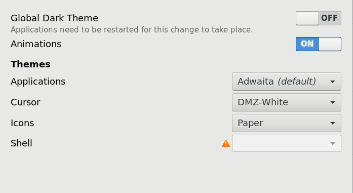
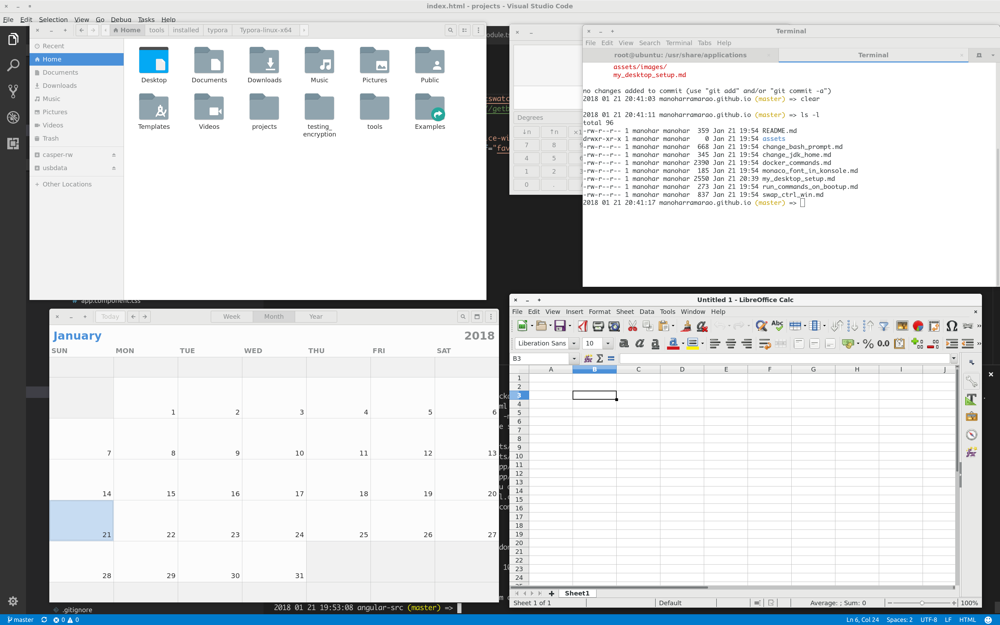

# Desktop Setup

1. Operating system
   
   ```
    2018 01 21 19:55:00 manoharramarao.github.io (master) => lsb_release -a
    No LSB modules are available.
    Distributor ID:    Ubuntu
    Description:    Ubuntu 17.10
    Release:    17.10
    Codename:    artful
    2018 01 21 19:57:06 manoharramarao.github.io (master) =>
   ```

2. After installing Ubuntu, following steps were executed to get back to default gnome session
   
   ```
    $ sudo apt install gnome-session
    $ sudo update-alternatives --config gdm3.css
   ```
   
    References 
    ​    http://www.omgubuntu.co.uk/2017/10/install-vanilla-gnome-shell-ubuntu-17-10
    ​    https://askubuntu.com/questions/966502/default-gnome-on-17-10
    As part of the second link, here are the commands - But this was not executed
   
   ```
    $ sudo apt remove gnome-shell-extension-ubuntu-dock
    $ gsettings set org.gnome.shell enable-hot-corners true
    $ sudo apt install gnome-themes-standard
    $ sudo apt install gnome-tweak-tool
   ```

3. Desktop - Gnome desktop

4. Gnome shell version
   
   ```
    2018 01 21 19:57:06 manoharramarao.github.io (master) => gnome-shell --version
    GNOME Shell 3.26.2
    2018 01 21 19:58:29 manoharramarao.github.io (master) => 
   ```

5. Themes
   
    

6. Gnome-tweaks
   
   1. Fonts - Scaling factor - 1.50
   2. Window title - Ubuntu Medium 11
   3. Interface - Sans Regular 9
   4. Document - Sans Regular 9
   5. Monospace - Sans Regular 13
   6. Programming fonts in all IDEs - Monaco 14
   7. Hinting - slight
   8. Antialiasing - Standard (grayscale)
   9. Keyboard & Mouse => Additional layout options => Alt/Win key behaviour - Ctrl is mapped to win keys

7. Settings app changes
   
   1. Devices => keyboard => system => show the overview - Alt + Space
   2. Devices => Displays => Night Light - On

8. Encrypted home directory and swap partition using ecryptfs
    https://websiteforstudents.com/encrypt-home-folder-ubuntu-17-10/
   
   ```
    # Step1 - install ecryptfs-utils
    $ sudo apt install ecryptfs-utils cryptsetup
   
    # Step2 - Create Temporary user (should be administrator)
    # Step3 - Login as temp user created above
    # Step4 - encrypt home dir of intended user (Not the temp user created above)
    $ sudo ecryptfs-migrate-home -u <Intended user>
   
    # Step6 - Read the output carefuly
    # Step7 - Login with user you gave in the above command as "Intended user"
    # Step8 - retrieve your passphrase - required to decrypt
    $ ecryptfs-unwrap-passphrase
   
    # Step9 - encrypt swap partition
    $ sudo ecryptfs-setup-swap
   ```

9. Understand how "Passwords and keys" app works in gnome

10. dconf-editor changes
    
    1. /org/gnome/desktop/wm/preferences/button-layout - close,minimize,maximize

## Screenshots



