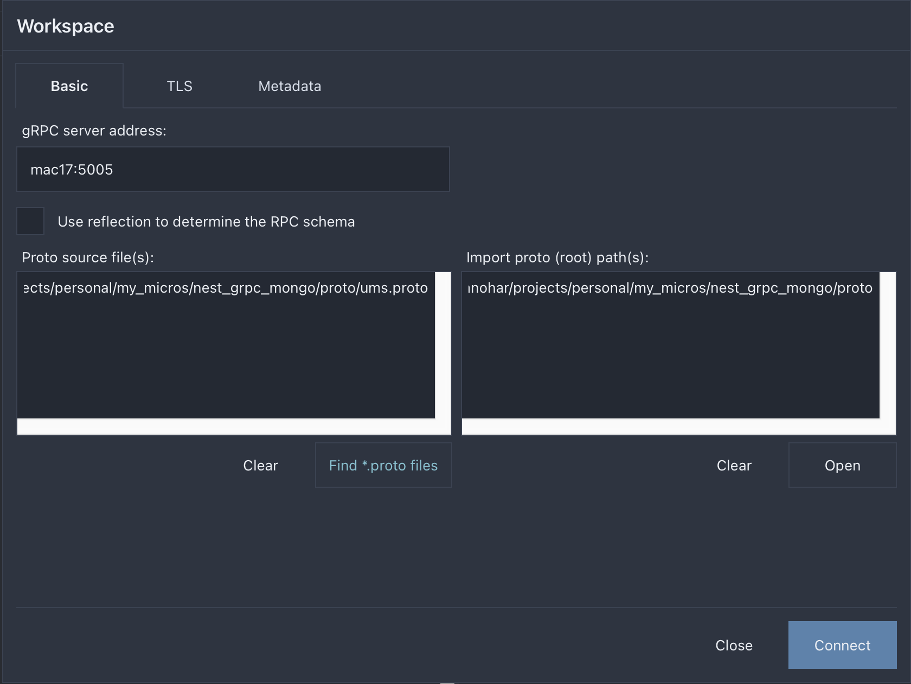
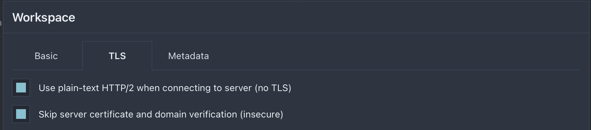
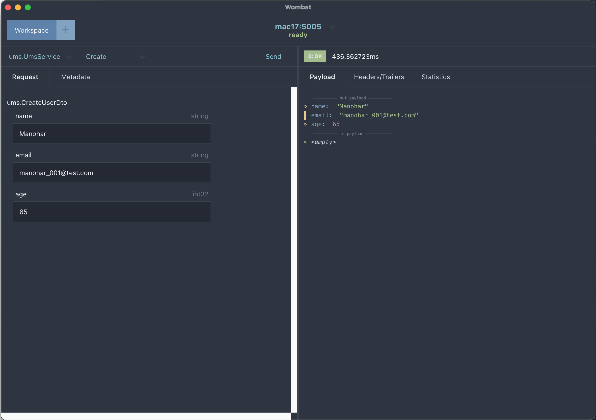
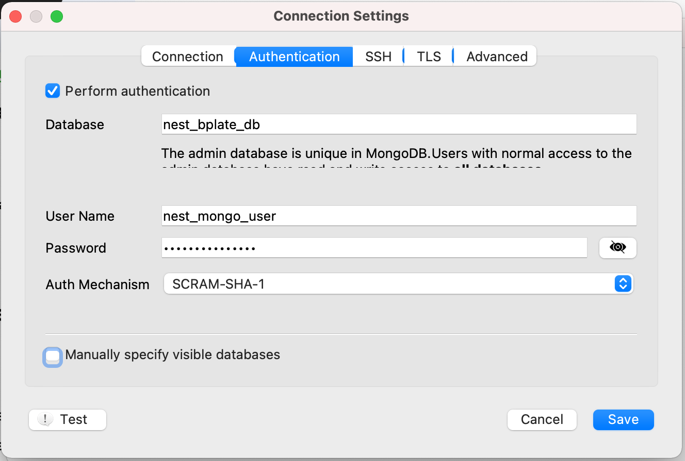
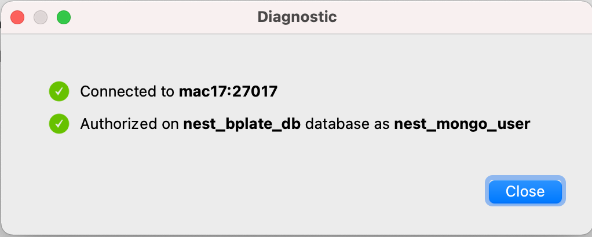
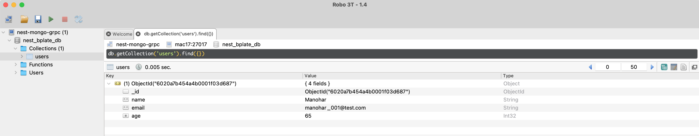

# NestJS Mongo GRPC boilerplate setup

## Prerequisites

Docker

docker-compose

Wombat - https://github.com/rogchap/wombat/releases

## Steps to install

**Step 1 -** Clone the repository https://gitlab.com/mymicroservices1/templates/nest-grpc-mongo.git

**Step 2 -** build the image

```bash
$ cd <project root>
$ docker-compose build --no-cache
```

**Step 3 -** Start docker containers

```bash
$ docker-compose up
```

Mongo DB container is built in this step

**Step 4 -** Open Wombat and test it

Below are the settings for Wombat










**Step 5 -** Robo3T - check if you have the record in the DB








